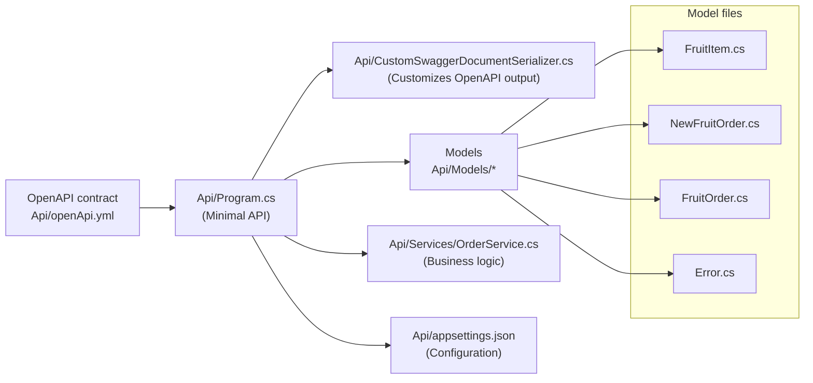

# Contract First Development with Minimal APIs in .NET

This repository demonstrates a contract-first approach for building a Minimal API in .NET 8. The OpenAPI contract was designed first and the implementation was written to match the contract. The implementation was created with the help of an AI agent, `GitHub Copilot`, which assisted in shaping the code to conform to the contract.

Key files and responsibilities:

- `Api/openApi.yml` - The OpenAPI contract (design-first specification).
- `Api/Program.cs` - Minimal API entry point that wires endpoints to the contract.
- `Api/CustomSwaggerDocumentSerializer.cs` - Custom serializer used to shape the generated swagger document to match the contract.
- `Api/Models/*` - Data models used by the API (`FruitItem.cs`, `NewFruitOrder.cs`, `FruitOrder.cs`, `Error.cs`).
- `Api/Services/OrderService.cs` - Business logic and in-memory storage for orders.
- `Api/appsettings.json` - Configuration for the API hosting and options.

Mermaid diagram (architecture overview):

How to run:

1. Open a terminal in the `Api` directory.
2. Run `dotnet run` to start the Minimal API.
3. The API exposes endpoints implemented to match the OpenAPI contract in `Api/openApi.yml`.

This project serves as an example of aligning code to a pre-defined contract and shows how tooling and AI assistance can help keep implementation consistent with the specification.

