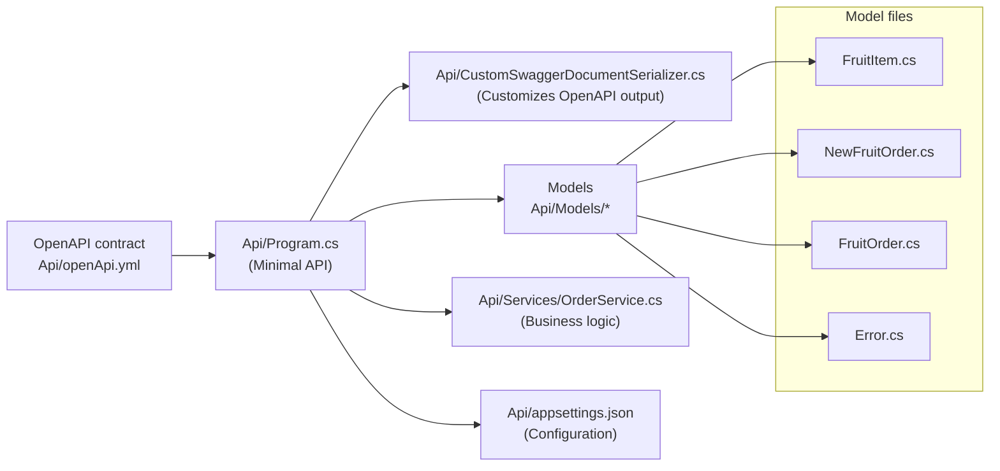

# Contract First Development with Minimal APIs in .NET

## Overview

This repository demonstrates a contract-first approach for building a Minimal API in .NET 8. The OpenAPI contract was designed first and the implementation was written to match the contract. The implementation was created with the help of an AI agent, `GitHub Copilot`, which assisted in shaping the code to conform to the contract.

Key files and responsibilities:

- `Api/openApi.yml` - The OpenAPI contract (design-first specification).
- `Api/Program.cs` - Minimal API entry point that wires endpoints to the contract.
- `Api/CustomSwaggerDocumentSerializer.cs` - Custom serializer used to shape the generated swagger document to match the contract.
- `Api/Models/*` - Data models used by the API (`FruitItem.cs`, `NewFruitOrder.cs`, `FruitOrder.cs`, `Error.cs`).
- `Api/Services/OrderService.cs` - Business logic and in-memory storage for orders.
- `Api/appsettings.json` - Configuration for the API hosting and options.

Mermaid diagram (architecture overview):

How to run:

1. Open a terminal in the `Api` directory.
2. Run `dotnet run` to start the Minimal API.
3. The API exposes endpoints implemented to match the OpenAPI contract in `Api/openApi.yml`.

## Contract Testing

This project uses Specmatic to verify the running API implements the OpenAPI contract in `src/Api/openApi.yml`.

### Local (developer machine)

- Prerequisites: Docker Desktop (or Docker Engine) and PowerShell (`pwsh`) or Windows PowerShell.
- From the repository root run the wrapper script which starts the API and runs Specmatic:
  - Windows PowerShell: `.	tests\run.ps1`
  - PowerShell Core / Linux: `pwsh ./tests/run.ps1`
- What the script does:
  - Runs `docker compose -f tests/docker-compose.yaml up -d --build` which builds and starts two services: the `api` service and a `contract-test` service (Specmatic).
  - Specmatic reads the mounted contract at `src/Api/openApi.yml` and runs verification against the `api` provider.
  - Reports (HTML and JUnit XML) are written to `tests/build/reports/specmatic` (the compose setup mounts this into the Specmatic container).

## CI (GitHub Actions)

- The workflow `.github/workflows/dotnet.yml` runs the contract script as part of the `build` job:
  - Step: `pwsh -NoProfile -ExecutionPolicy Bypass -File tests/run.ps1`
- Artifacts produced by Specmatic are uploaded from the runner path `tests/build/reports/specmatic`:
  - JUnit XML: `tests/build/reports/specmatic/TEST-junit-jupiter.xml`
- Important: the workflow needs permission to create check runs if you use an action that reports results as checks. The job in this repo grants `checks: write` under `jobs.build.permissions` so the publish action can create check runs. For pull requests from forks the `GITHUB_TOKEN` may be restricted; in that case use a PAT stored in repository secrets.

Troubleshooting

- If the GitHub Actions logs show "No files were found" for uploads, confirm Specmatic wrote reports to `tests/build/reports/specmatic` on the runner and that the workflow uploads the same path.
- If Specmatic returns plain text error responses for malformed input, the API should convert those to JSON error responses so the contract examples match the actual response content type. The API in `src/Api/Program.cs` includes middleware to map malformed JSON errors to a JSON `Error` response.

## Next Steps

Kiota can be used to generate client SDKs from the OpenAPI contract in `Api/openApi.yml`. This allows consumers to interact with the API using strongly typed clients generated from the contract.

